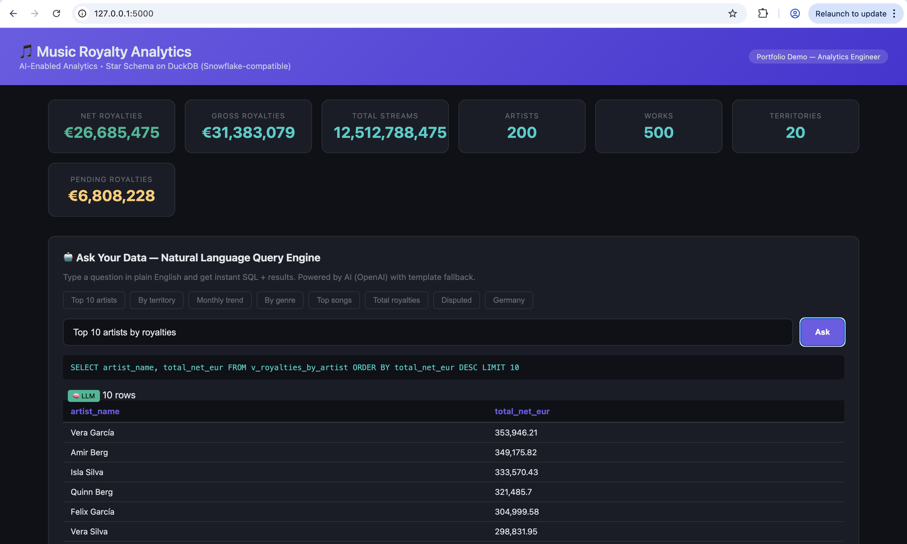

# 🎵 Music Royalty Analytics — AI-Enabled Analytics Platform

> **Portfolio project** demonstrating modern analytics engineering.  
> Demonstrates: star-schema data modeling, ETL pipelines, data quality monitoring,
> interactive dashboards, and **AI-enabled natural-language querying** — all on a
> Snowflake-compatible analytical engine (DuckDB).



---

## ✨ Key Features

| Feature | What It Shows |
|---|---|
| **Star Schema (DuckDB)** | Dimensional modeling with dims + facts — directly portable to Snowflake |
| **ETL Pipeline** | Python-based Extract → Transform → Load from CSV into warehouse |
| **Data Quality Framework** | Automated row-count, null, referential integrity & metric checks |
| **NL→SQL Query Engine** | 🤖 Users ask questions in plain English → AI generates SQL → results returned |
| **Interactive Dashboard** | Plotly-powered charts, KPI cards, territory/platform/genre drill-downs |
| **Docker** | One-command containerized deployment |

---

## 🏗️ Architecture

```
┌──────────────────────────────────────────────────────────┐
│                    Flask Dashboard (:5000)                │
│  ┌──────────┐  ┌──────────────┐  ┌───────────────────┐  │
│  │ KPI Cards│  │ Plotly Charts│  │ NL Query Engine 🤖│  │
│  └────┬─────┘  └──────┬───────┘  └────────┬──────────┘  │
│       │               │                   │              │
│       └───────────────┼───────────────────┘              │
│                       ▼                                  │
│              ┌─────────────────┐                         │
│              │  DuckDB Warehouse│  ← Snowflake-compatible│
│              │  (Star Schema)   │                        │
│              └────────┬────────┘                         │
│                       │                                  │
│              ┌────────┴────────┐                         │
│              │   ETL Pipeline  │                         │
│              └────────┬────────┘                         │
│                       │                                  │
│              ┌────────┴────────┐                         │
│              │  CSV Data Layer │                         │
│              └─────────────────┘                         │
└──────────────────────────────────────────────────────────┘
```

## 📊 Star Schema Design

```
                    ┌───────────────┐
                    │  dim_artists  │
                    │───────────────│
                    │ artist_id PK  │
                    │ artist_name   │
                    │ role          │
                    │ society       │
                    │ country       │
                    └───────┬───────┘
                            │
┌──────────────┐    ┌───────┴────────┐    ┌────────────────┐
│ dim_platforms │    │ fact_royalties │    │dim_territories │
│──────────────│    │────────────────│    │────────────────│
│platform_id PK│◄───│ platform_id FK │    │territory_id PK │
│platform_name │    │ work_id FK     │───►│ iso_code       │
│platform_type │    │ artist_id FK   │    │ name           │
└──────────────┘    │ territory_id FK│    │ region         │
                    │ date_key FK    │    └────────────────┘
                    │ gross_eur      │
┌──────────────┐    │ commission_eur │    ┌────────────────┐
│  dim_dates   │    │ net_eur        │    │   dim_works    │
│──────────────│    │ status         │    │────────────────│
│ date_key PK  │◄───│                │───►│ work_id PK     │
│ year         │    └────────────────┘    │ iswc           │
│ quarter      │                          │ title          │
│ month        │    ┌────────────────┐    │ genre          │
│ month_name   │    │  fact_streams  │    │ artist_id FK   │
│ day_of_week  │    │────────────────│    │ release_date   │
│ is_weekend   │    │ stream_id PK   │    │ duration_secs  │
└──────────────┘    │ work_id FK     │    └────────────────┘
                    │ territory_id FK│
                    │ platform_id FK │
                    │ date_key FK    │
                    │ stream_count   │
                    └────────────────┘
```

---

## 🤖 NL→SQL: AI-Enabled Analytics

The flagship feature — users type questions in plain English:

| Question | Generated SQL (simplified) |
|---|---|
| *"Top 10 artists by royalties"* | `SELECT artist_name, total_net_eur FROM v_royalties_by_artist ORDER BY total_net_eur DESC LIMIT 10` |
| *"Royalties by territory"* | `SELECT territory_name, total_net_eur FROM v_royalties_by_territory ORDER BY …` |
| *"Monthly trend"* | `SELECT year, month, total_gross_eur, total_net_eur FROM v_monthly_trend …` |
| *"Royalties in Germany"* | `… WHERE t.iso_code='DE' …` |

**Two modes:**
- **🧠 LLM mode** — Uses OpenAI GPT-4o-mini with schema context for any question
- **📋 Template mode** — Regex-based fallback (no API key needed) for common queries

---

## 🚀 Quick Start

### Prerequisites
- Python 3.10+
- (Optional) OpenAI API key for LLM-powered queries
- (Optional) Docker for containerized deployment

### Local Setup

```bash
# Clone
git clone https://github.com/YOUR_USERNAME/music-royalty-analytics.git
cd music-royalty-analytics

# Create virtual environment
python3 -m venv .venv && source .venv/bin/activate

# Install dependencies
pip install -r requirements.txt

# Copy env config (optional — add your OpenAI key for LLM mode)
cp .env.example .env

# One-command: generate data → ETL → DQ checks → launch dashboard
python3 run.py
```

Then open **http://localhost:5000** 🎉

### Docker

```bash
docker compose up --build
# → http://localhost:5000
```

### Step-by-step (manual)

```bash
python3 data/generate_data.py       # Generate synthetic CSVs
python3 models/etl.py               # Load into DuckDB warehouse
python3 models/data_quality.py      # Run DQ checks
python3 app/main.py                 # Start dashboard
```

---

## 🗂️ Project Structure

```
music-royalty-analytics/
├── app/
│   ├── __init__.py
│   ├── main.py                  # Flask dashboard application
│   ├── nl_query.py              # NL→SQL AI query engine
│   └── templates/
│       └── dashboard.html       # Interactive dashboard UI
├── data/
│   ├── generate_data.py         # Synthetic data generator
│   └── *.csv                    # Generated dimension & fact CSVs
├── models/
│   ├── __init__.py
│   ├── schema.sql               # Star schema DDL (Snowflake-compatible)
│   ├── etl.py                   # ETL pipeline (CSV → DuckDB)
│   └── data_quality.py          # DQ validation framework
├── static/                      # Static assets
├── config.py                    # Central configuration
├── run.py                       # One-command setup & launch
├── Dockerfile                   # Container image
├── docker-compose.yml           # Docker Compose config
├── requirements.txt             # Python dependencies
├── .env.example                 # Environment template
├── .gitignore
└── README.md
```

---

## 🔧 Snowflake Compatibility

This project uses **DuckDB** as a local, free, Snowflake-compatible analytical engine.
The SQL dialect, star schema design, and query patterns transfer directly to Snowflake:

| This Project (DuckDB) | Snowflake Equivalent |
|---|---|
| `read_csv_auto()` | `COPY INTO … FROM @stage` |
| DuckDB file | Snowflake database/schema |
| Python ETL script | Snowflake Tasks / dbt |
| Same SQL window functions, CTEs, QUALIFY | ✅ Compatible |

> Choosing DuckDB demonstrates engineering judgment: it provides the same analytical
> capabilities while making the project instantly runnable by anyone, anywhere — no
> cloud account or credentials required.

---

## 📋 Skills Demonstrated

| Skill Area | Demonstrated Here |
|---|---|
| SQL expertise & scalable data models | Star schema DDL, analytics views, CTEs |
| Dimensional modeling & star schemas | `dim_*` / `fact_*` tables with FKs |
| Snowflake data warehouse | DuckDB (Snowflake-compatible dialect) |
| ETL/ELT architecture | `models/etl.py` — CSV→DuckDB pipeline |
| BI dashboards & reporting | Flask + Plotly interactive dashboard |
| Python for data processing | Full Python stack |
| Docker | Dockerfile + docker-compose |
| GitHub collaborative dev | Git-ready project structure |
| Data quality monitoring | `models/data_quality.py` — 25+ automated checks |
| **AI-enabled analytics (NL query)** | `app/nl_query.py` — NL→SQL engine |

---

## 📄 License

MIT — built as a portfolio demonstration project.
